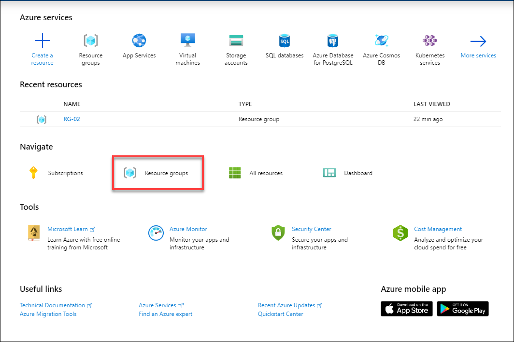
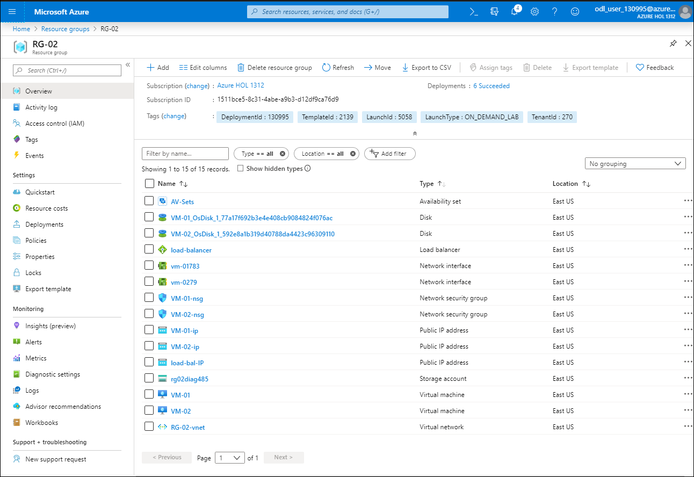
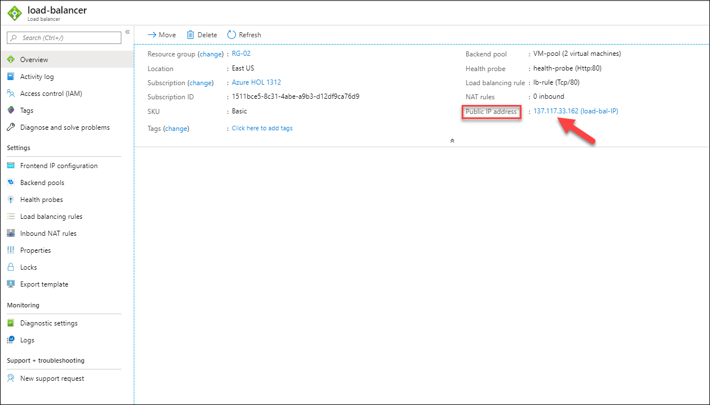
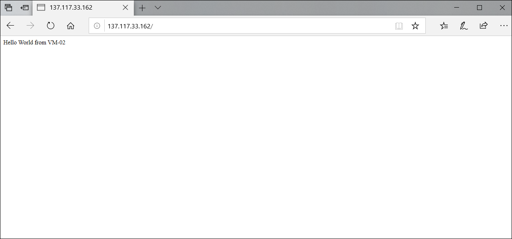
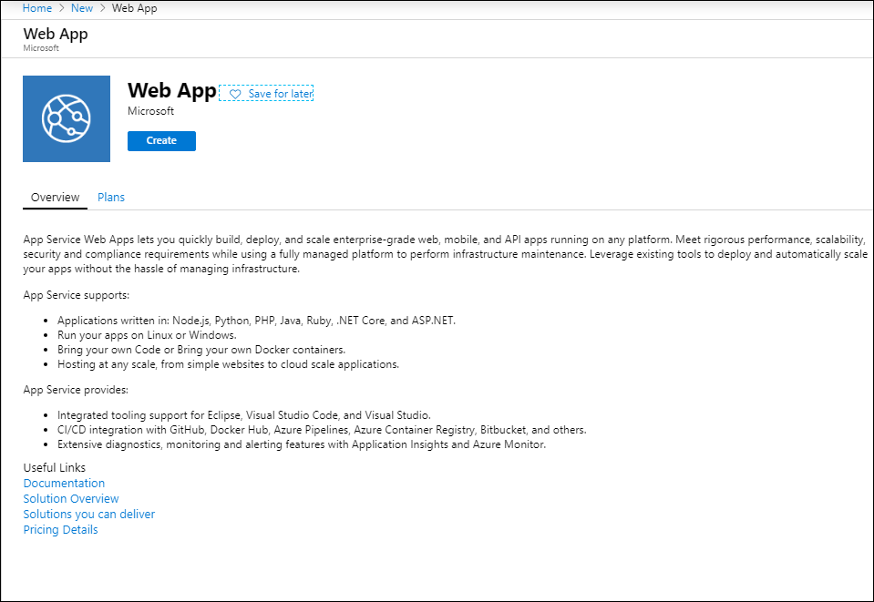
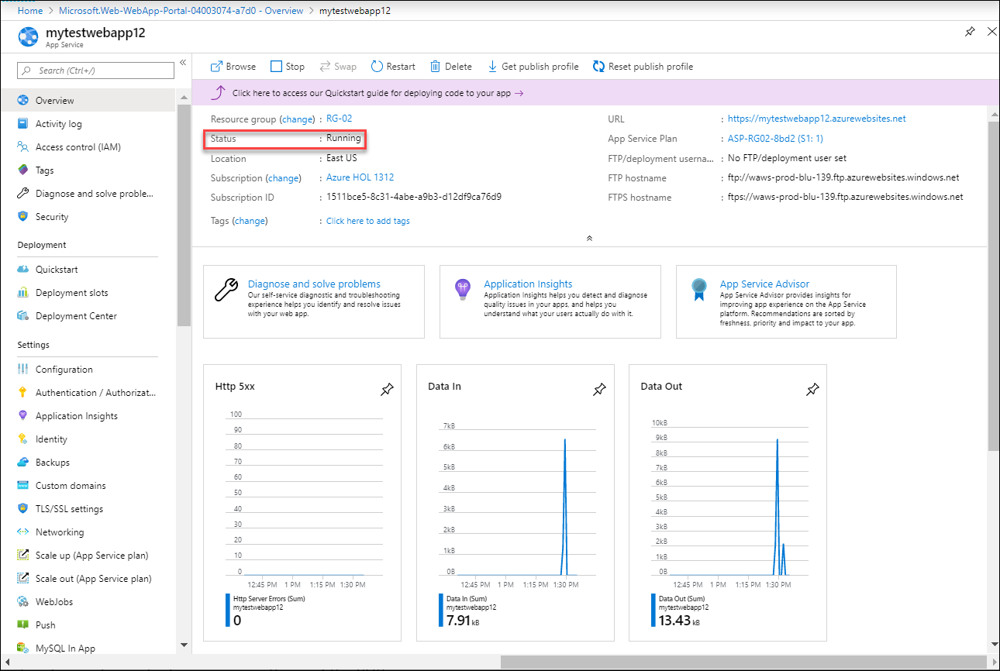
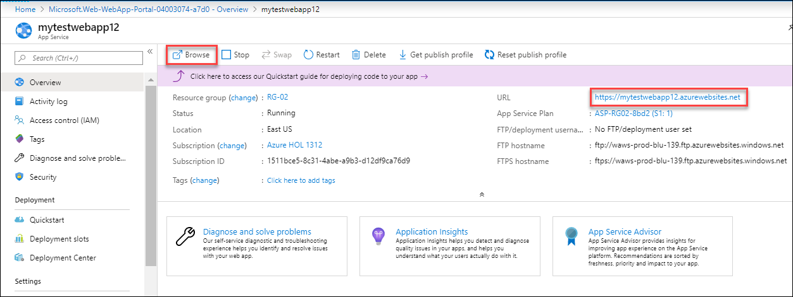

# Module 2: Understand core Azure services (30-35%) 

## Pre-created Resource Groups

**Resource Group RG-01**
This is a pre-created Resource Group which is empty and can be used to deploy any new Azure resources, if needed.

**Resource Group RG-02**
Another pre-created RG but having resources already deployed in it. Pre-created resources are listed below:

i. Windows Virtual Machines 

ii. Load Balancer

iii. Virtual Network

iv. VMs has been configured with Load Balancer and Availability Sets

v. NSG Rules: RDP and HTTP (port no. 3389 80 has been enabled)

## Lab 1: Try the possible regions in a new resource deployment

In these steps, you will provision a Web App within a single App Service Plan

1.	Sign into the Azure Portal (https://portal.azure.com).
2.	Select +Create a resource, then select Web and finally select Web App. Select the Create button.

On the Create Web App blade, enter the following:

•	Subscription: Select your subscription.

•	Resource Group: Select Use existing, and select the **RG-01** resource group.

•	Name: Provide a unique name

•	Runtime stack: ASP.NET 4.7

•	Publish: Choose Code option.

•	OS: Windows

•	Region: Try any US Region

•	App Service plan: (S1)

•	Select Review and Create to provision both Web App and the App Service Plan. Select the Create button.

•	When provisioning completes, navigate to your new Web App in the portal by selecting on App Services, and then selecting your web app to check out the web app you created. 

## Use of pre-created resources you have:

**Windows Virtual machines:**

You have two windows virtual machines which has been configured with Availability Sets and Load Balancer

**Use of Availibility Sets in Azure**

An Availability Set is a logical grouping capability for isolating VM resources from each other when they're deployed. Azure makes sure that the VMs you place within an Availability Set run across multiple physical servers, compute racks, storage units, and network switches. If a hardware or software failure happens, only a subset of your VMs are impacted and your overall solution stays operational. Availability Sets are essential for building reliable cloud solution.

**Load Balancer**

With Azure Load Balancer, you can scale your applications and create high availability for your services. Load Balancer supports inbound and outbound scenarios, provides low latency and high throughput, and scales up to millions of flows for all TCP and UDP applications.

Load Balancer distributes new inbound flows that arrive at the Load Balancer's front end to back-end pool instances, according to specified rules and health probes.

A public Load Balancer can provide outbound connections for virtual machines (VMs) inside your virtual network by translating their private IP addresses to public IP addresses.

**Featured of Load Balancer:**

1. Health probes

To determine the health of instances in the back-end pool, Load Balancer uses health probes that you define. When a probe fails to respond, the Load Balancer stops sending new connections to the unhealthy instances. A probe failure doesn't affect existing connections. The connection continues until the application terminates the flow, an idle timeout occurs, or the VM shuts down.

Load Balancer provides different health probe types for TCP, HTTP, and HTTPS endpoints. 

2. Backend Pools:

To distribute traffic to the VMs, the load balancer uses a back-end address pool. The back-end address pool contains the IP addresses of the virtual network interfaces (NICs) that are connected to the load balancer.( We add the VMs here to get configured it with load balancer)

3. Load Balancing Rule:

A load balancer rule defines the frontend IP configuration for the incoming traffic and the backend pool to receive the traffic, along with the required source and destination port.

## Explore RG-02 and review the resources you have. 

1. Navigate to Resource Groups

2. Click on RG-02 resource group 

 Now you will see the list of pre-created resources you have.
 

 
3. We have installed IIS servers on both the VMs so that you can test the load among both VMs

**IIS Server**: 
IIS is a web server application that comes with Windows Server and is used to serve up web sites while Azure is a Windows hosting solution that utilizes IIS

**Please follow the below steps to test the load on VMs:**

1. Navigate to RG-02 and click on load balancer

2. As, we have configured the VMs with load balancer so now we can test the load by browing the Load Balancer Public IP. Copy the load balancer IP and browse to see the output:

3. It will distributes the load among both the VMs based on the traffic load. 

> When it distrubutes the load to **VM-01** you will see the output similar as below:

> When it distrubutes the load to **VM-02** you will see the output similar as below:

## Deploy a Web App Service in Azure and perform basic operations:

Please follow these steps to deploy a Azure web app service if you haven't created previously:

1. Click on + create new resource on the left top corner. Search for **web app** in the search bar

2. On the Create Web App blade, enter the following:

•	Subscription: Select your subscription.

•	Resource Group: Select Use existing, and select the **RG-01** resource group.

•	Name: Provide a unique name

•	Runtime stack: ASP.NET 4.7

•	Publish: Choose Code option.

•	OS: Windows

•	Region: Try any US Region

•	App Service plan: (S1)

•	Select Review and Create to provision both Web App and the App Service Plan. Select the Create button.

•	When provisioning completes, navigate to your new Web App in the portal by selecting on App Services, and then selecting your web app to check out the web app you created.

> You can see the status of web app is running now. 

**You can browse the web app by navigating the URL as shown in below image** ( you can copy/paste the URL **OR** just lick on browse button.

